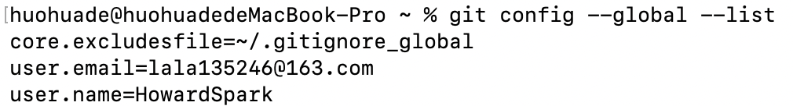
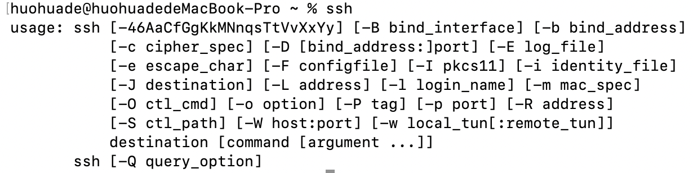
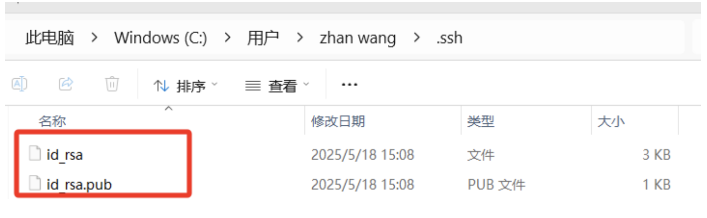
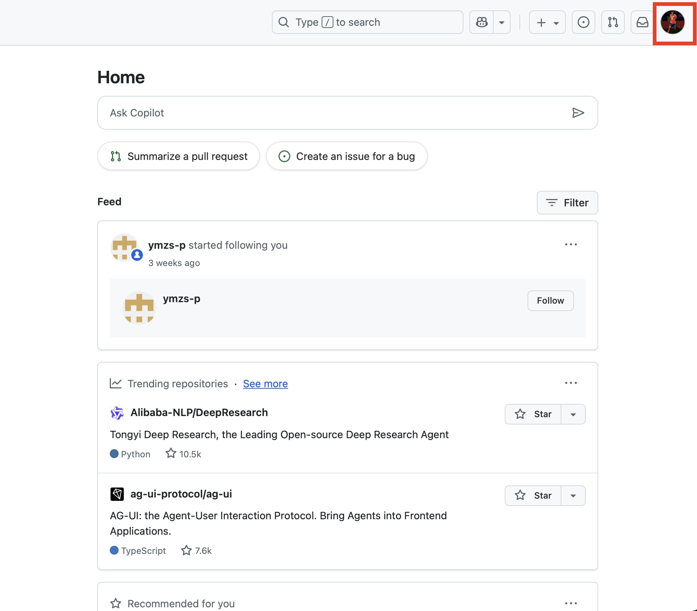
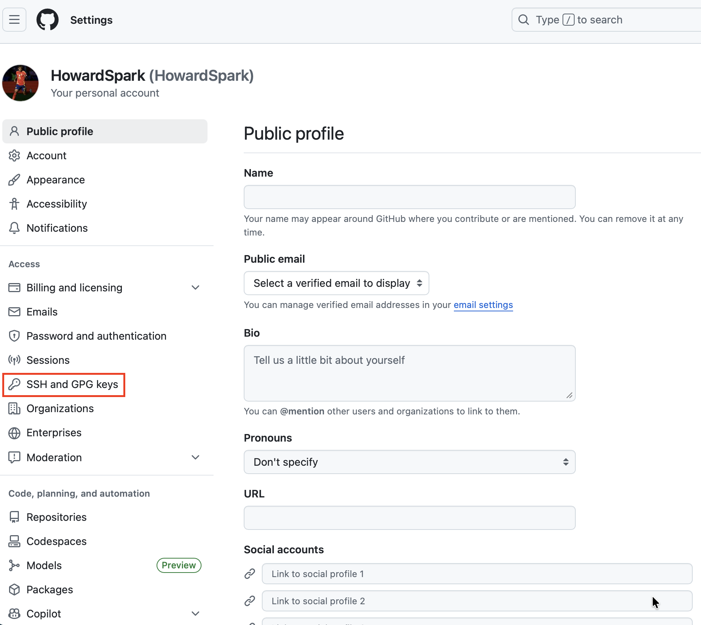
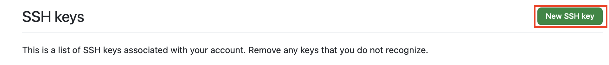
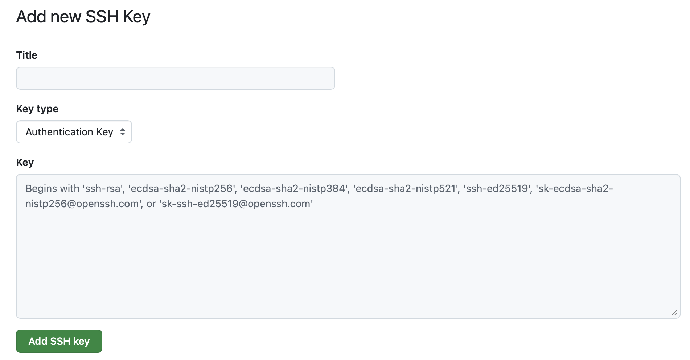
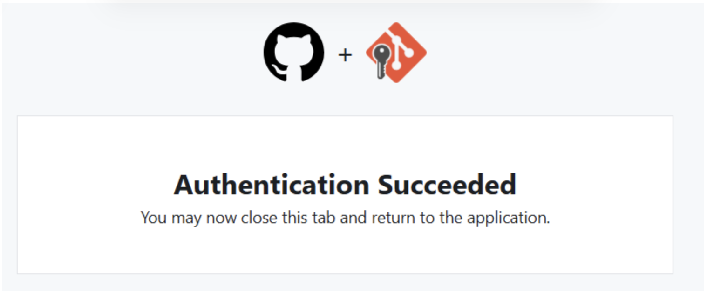
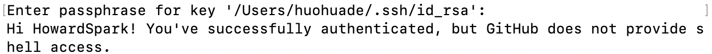

### git项目准备工作

----------

1. 下载git

2. 注册github账号

3. git配置

   打开Git bash，推荐在桌面添加快捷方式。输入下列代码

   ```bash
   git config --global user.name "用户名"
   ```

   ```bash
   git config --global user.email "邮箱"
   ```

   这两步的作用是负责设置github上传代码时显示的提交信息。其中，将用户名改为自己github的名字即可，邮箱二字替换为github的注册邮箱。

   **注意**：全英文输入，注意空格和大小写，还有引号不要""漏掉。

   完成后，在Git bash中输入下列代码进行检验：

   ```bash
   git config --global --list 
   ```

   若出现下面的情景说明设置成功，检查一下有没有打错字，如果有重复前两步。

   

4. git本地与远程仓库绑定

   尽管现在下载了git和创建了github账号，但是github只是众多代码托管平台的一个，我们还需要让git和github绑定一下，这样git才知道要把代码提交到哪里。

   - 检查本机是否安装了SSH
     在Git bash中输入以下代码：

     ```bash
     ssh
     ```

     Windows系统默认是没有安装的，可能需要安装一下。出现下图说明安好了。

     

   - 生成ssh密钥：
     ```bash
     ssh-keygen -t rsa
     ```

     这段代码执行后，可能整个过程需要点击三次回车，按照英文说明操作即可。

   - 查看ssh密钥：
     成功生成ssh密钥后，密钥文件一般会存放在该路径下：C:\用户\ .ssh
     其中会有两个文件，
     

   - id_rsa是私钥，id_rsa.pub是公钥。

   - 设置ssh密钥：
     登录github网页版，点击右上角头像
     

     进入设置
     

     屏幕左侧点击SSH and GPG keys
     

     点击生成新的SSH密钥

     
     title随便起名就可以，在下方key区域粘贴id_rsa.pub中的内容。

     

     点击下方绿色按钮，应该会向github的注册邮箱发一封验证邮件，完成验证后会显示如下内容：
     
     这样git和github的绑定操作就完成了。Git bash中输入以下代码进行检验：

     ```bash
     ssh -T git@github.com
     ```

     显示下面的内容说明绑定成功。
     

     下面就可以提交代码了

5. 在本地克隆远程仓库中的代码
   现在我们需要在本地下载github上团队配置好的初始代码

   - 在C盘以外任何盘中创建一个文件夹。文件的位置随意，只要方便自己寻找就可以，注意路径中不要出现中文即可。

   - 在Git bash中，使用cd指令到达刚刚建立的文件夹，这里cd指令的使用方法和Linux系统中bash的cd使用方法一致。假设刚刚的文件夹在D盘或其他盘的话(在哪个盘就输入哪个盘符)，需要先输入：
     ```bash
     cd D
     ```

     然后一步步cd到刚刚创建的文件夹内即可。

   - 这里先cd到项目文件夹，注意确保steam++打开加速，然后输入：
     ```bash
     git clone https://github.com/HowardSpark/Web-Server
     ```

     等待片刻，会发现在该文件夹中出现了项目代码。
     相同操作，输入：

     ```bash
     git clone https://github.com/HYHSerein/Web-Front-End
     ```

     稍等片刻，会发现前端代码出现在了该文件夹中。

     最后检查一下，这个文件夹中有一个文件夹(Web-Front-End)存放前端代码，另一个文件夹(Web-Server)存放后端代码。
     然后现在尽量先不要改其中的代码，看完git协作在进行开发。