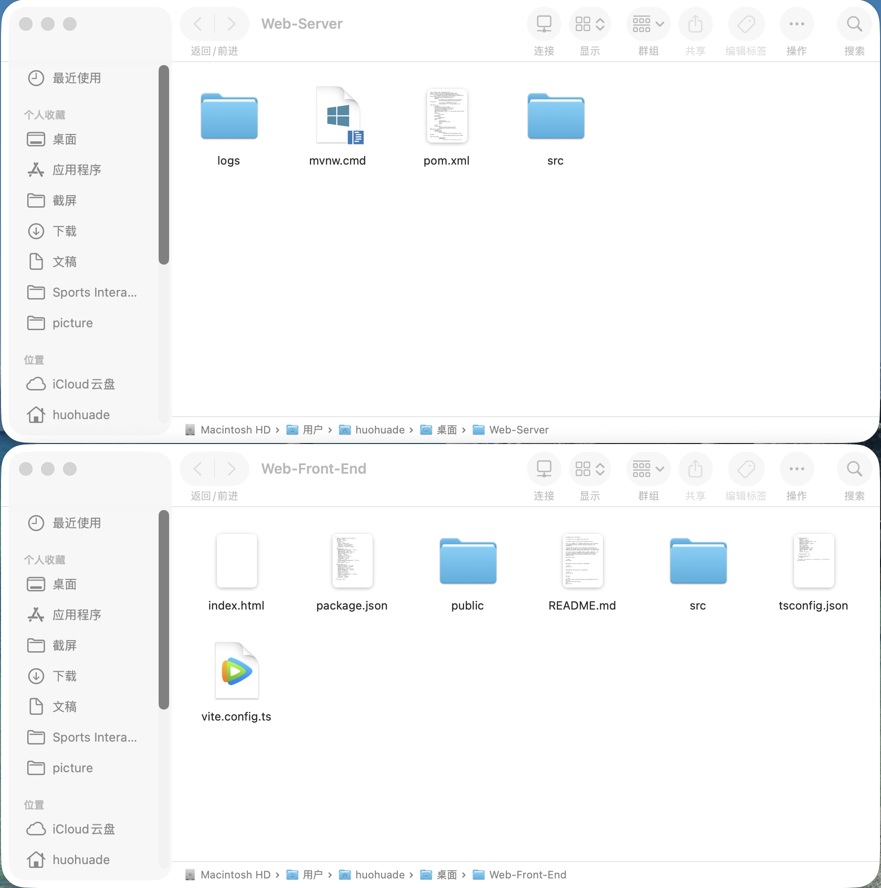
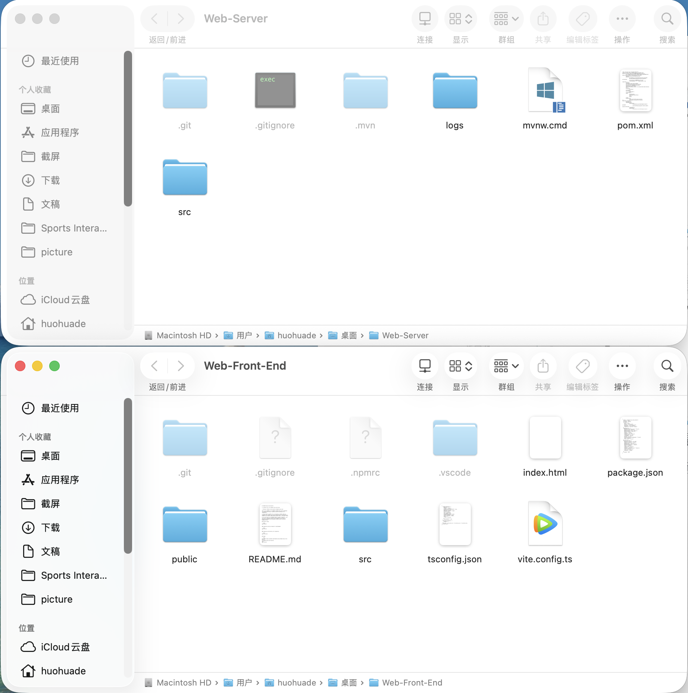
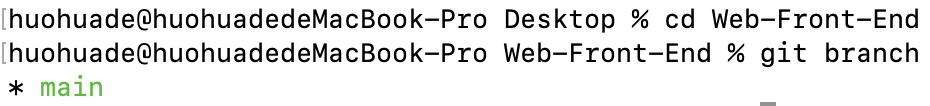
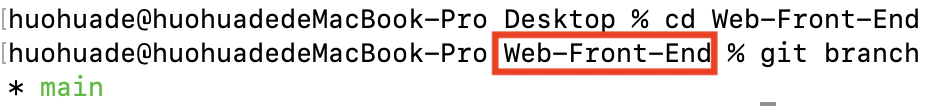
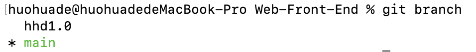
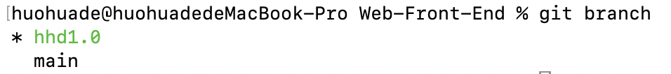

### git项目协作

---

我们已经完成了git的配置和github账号的注册，接下来完成最后的操作就可以正式开始写代码了。

1. 确保自己完成了将github仓库项目clone到本地的操作，我们用两个不同的文件夹分别盛放前端和后端项目代码，就像下面这样：
   
   上面是后端项目，下面是前端项目。

   如果大家设置隐藏文件可见的话，会发现：
   
   多出了很多隐藏文件，不用管就可以。

2. 创建分支
   为了每个人能够同时对同一项目进行开发，并且互不干扰，我们需要创建分支，分支的名字可以以“姓名首字母+版本号”的形式命名，版本号从1.0开始即可，想自己起名字也可以，只要不出现中文就行。

   以下面为例，先在bash的前端文件夹中输入：

   ```bash
   git branch
   ```

   不出意外，会看到：
   

   **一定要确保自己已经cd到前端文件夹内了**，如图：

   
   红框内标注的是当前所在目录，确保是在该文件目录，**一定要确保**。(从github上clone下来名字都是这个)
   我们注意到当前是在main(或者叫master)分支，这是项目的主分支，我们现在要从主分支中分出各自的小分支，就像一棵大树生出枝杈一样，main分支就是树干，每个人的分支就是枝杈。以我的分支为例，在bash中输入(把branch后面改成自己分支的名字就行)：

   ```bash
   git branch hhd1.0
   ```

   再输入：

   ```bash
   git branch
   ```

   备注：该命令用于分支总览。
   会见到下面这样：
   
   发现多出了自己刚刚创建的分支，但是星号*依然在main的前面，说明我们只是创建了新分支，但是并没有切换到新分支上去，相当于还是在树干上。所以要输入下面的指令切换到自己的分支上：

   ```bash
   git switch hhd1.0
   ```

   再次输入：

   ```bash
   git branch
   ```

   
   现在星号*出现在我们自己的分支前面了，这样就对了。
   同理，后端项目重复上述操作即可。

3. 项目代码编写
   在分好工之后，大家就可以各自开始进行代码的编写了，**一定要确保在自己创建的分支下进行开发**，不然在项目合并的时候会遇到一些不必要的问题。

4. 代码提交
   当你确保自己撰写的代码没有bug(可以有bug，但一定不要让整个项目运行不起来就行)，就可以进行代码提交了。
   同样，一定确保在自己的分支下进行提交，如果不在，请务必输入下面的指令：

   ```bash
   git switch 你的分支名
   ```

   然后进行代码提交，依次输入：

   ```bash
   git add .
   ```

   ```bash
   git commit -m "引号中的部分写写自己写的代码的功能，简单一句话即可"
   ```

   ```bash
   # 只有这个分支的第一次提交需要输入这行指令
   git push --set-upstream origin 自己的分支名
   ```

   ```bash
   git push
   ```

   ```bash
   # 输入下面这行指令检查一下自己提交的状态
   git status
   ```

   如果显示这样就对了:

   

   然后代码就被推送到github上了，当管理员进行合并和解决代码冲突等问题后，代码就会成功合并到项目代码中去了，还是比较智能的。

5. 代码下载
   当我们完成了第一次提交后，后面的开发可能要根据更新后的项目进行开发，因此是不能用最初的项目文件的，所以需要进行手动更新。依然要**确保在自己的分支下**，在bash中输入下面的指令：

   ```bash
   # 切换到自己的分支
   git switch 自己的分支名
   ```

   ```bash
   git pull
   ```

   然后就可以进行后续开发了。

到这里，基本上就告一段落了。