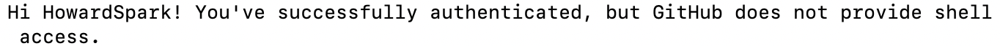

### 问题补充

---

1. SSH公钥生成后如果文件无法打开查看的话，可以在Git bash中输入：

   ```bash
   vim ~/.ssh/id_rsa.pub
   ```

   对公钥内容进行查看和复制。

   也可以：

   ```bash
   cat ~/.ssh/id_rsa.pub
   ```

   同样可以查看公钥内容和进行复制。

2. 在配置完公钥后可能会在输入：
   ```bash
   ssh -T git@github.com
   ```

   时出现服务器端口无法连接的情况。不要怀疑，只要之前出现过下面的场景：
   
   就说明SSH密钥已经成功配置，只是在检验是否成功配置上遇到了问题，跳过检验环节即可。

3. 由于网络连接不稳定的问题，在进行操作时可能会因此出现失败的现象，建议先尝试重新输入指令再试一次，再考虑别的原因。

4. .pdf格式中的指令复制出来是含有少量乱码的，可以使用vscode或者ide将markdown文件拖进去进行查看和复制指令。

